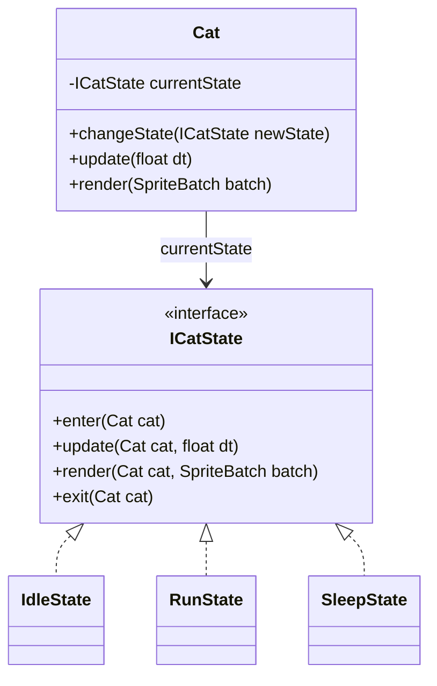
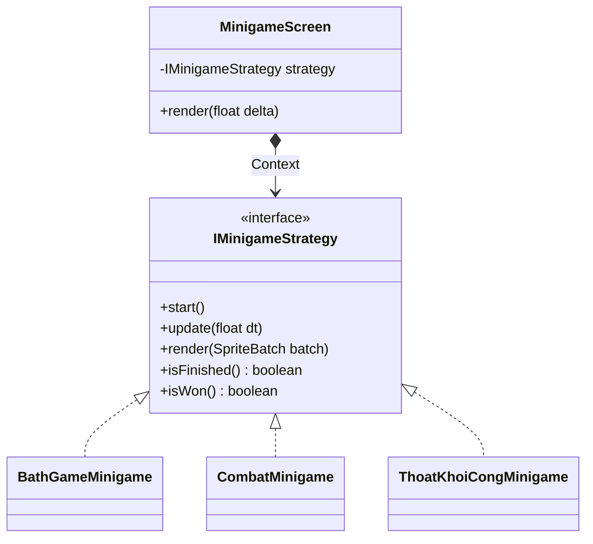

# Báo Cáo Chuyên Đề Lập Trình Hướng Đối Tượng - Dự Án CatLife

**Nhóm:** 5
**Môn học:** Lập trình Hướng Đối Tượng (OOP)

---

## 1. Giới thiệu dự án (Overview)
**CatLife** là một tựa game 2D nhập vai vòng đời giả lập, nơi người chơi hóa thân thành một chú mèo lang thang, tương tác với thế giới xung quanh thông qua các hệ thống nhiệm vụ, thời gian thực (ingame) và hàng loạt các minigame đa dạng. Game sở hữu hệ thống cốt truyện phân nhánh với nhiều cái kết (Endings) tùy thuộc vào kết quả của các sự kiện và chỉ số sinh tồn của người chơi.

## 2. Công nghệ sử dụng (Technologies)
- **Ngôn ngữ lập trình:** Java (Phiên bản >= 8)
- **Game Engine/Framework:** LibGDX (LWJGL3 backend) - Lựa chọn vì đây là framework mã nguồn mở đa nền tảng, cung cấp quyền kiểm soát chặt chẽ vào vòng lặp game (game loop) và bộ xử lý đồ họa, cực kỳ phù hợp cho việc học và áp dụng các mẫu thiết kế (Design Patterns) của OOP từ đầu.
- **Quản lý dự án & Build tool:** Gradle
- **Thiết kế giao diện UI:** Scene2D (Gói công cụ UI linh hoạt tích hợp sẵn trong LibGDX)

## 3. Các Kỹ thuật OOP và Design Patterns đã sử dụng
Để đảm bảo mã nguồn dễ bảo trì, dễ mở rộng và tuân thủ các nguyên lý thiết kế (SOLID), nhóm đã áp dụng các Design Patterns sau:

### 3.1. Singleton Pattern
- **Áp dụng tại:** Các Manager cốt lõi (`GameManager`, `TimeManager`, `StoryManager`, `ScreenManager`, `ResourceManager`, `MapManager`).
- **Lý do lựa chọn:** Đảm bảo xuyên suốt vòng đời của trò chơi chỉ tồn tại duy nhất một phiên bản (instance) quản lý dữ liệu toàn cục. Giúp các thành phần khác có thể truy cập dễ dàng thông qua hàm `getInstance()` mà không cần phải truyền tham số đối tượng lằng nhằng qua từng Class, ngăn chặn xung đột dữ liệu.

### 3.2. State Pattern
- **Áp dụng tại:** Hệ thống hành vi di chuyển của Mèo (`ICatState`, `IdleState`, `RunState`, `SleepState`).
- **Lý do lựa chọn:** Tránh việc sử dụng cấu trúc `if-else` khổng lồ và rối rắm trong hàm `update()` để kiểm tra mèo đang làm gì. Pattern này chia nhỏ mỗi trạng thái thành một class riêng biệt. Mèo (Context) chỉ việc ủy quyền logic cho trạng thái hiện tại. Việc cập nhật thêm trạng thái hoàn toàn tuân thủ Open/Closed Principle.

### 3.3. Strategy Pattern
- **Áp dụng tại:** Hệ thống Minigame (`IMinigameStrategy`, `ThoatKhoiCongMinigame`, `CombatMinigame`...).
- **Lý do lựa chọn:** Game có hơn 10 minigames với luật chơi khác nhau. Thay vì tạo 10 Screen rườm rà, nhóm chỉ thiết kế một `MinigameScreen` (Context) duy nhất. Screen này nhận một `IMinigameStrategy` (Thuật toán) và gọi hàm chạy. Việc này giúp tái sử dụng hoàn toàn mã nguồn hệ thống như: nút Pause, Game Over overlay, chuyển cảnh, hệ thống input.

### 3.4. Observer Pattern
- **Áp dụng tại:** Hệ thống Cập nhật Giao diện HUD (`PlayerHUD`, `TimeHUD` đóng vai trò Observers; `Cat`, `TimeManager` đóng vai trò Subjects).
- **Lý do lựa chọn:** Nếu HUD phải liên tục kiểm tra dữ liệu máu, độ đói, thời gian mỗi khung hình (60 lần/giây) sẽ gây tốn tài nguyên vô ích. Nhờ Observer Pattern, HUD chỉ cập nhật nội dung văn bản (Text) khi nó nhận được thông báo (`notifyObservers()`) từ các Manager rằng dữ liệu thực sự đã thay đổi.

### 3.5. Builder Pattern & Chain of Responsibility
- **Áp dụng tại:** Hệ thống Kết cục Mở rộng (`EndingCondition`, `StoryManager`).
- **Lý do lựa chọn:** `EndingCondition.Builder` cho phép thiết lập linh hoạt các tham số điều kiện để đạt một cái kết (VD: cần thắng minigame A, máu > 50) mà không cần viết hàm Constructor dài ngoằng.

## 4. Cấu Trúc Lớp (Class Diagrams)

### Biểu đồ 1: Kiến trúc State Pattern (Máy Trạng Thái)

### Biểu đồ 2: Kiến trúc Strategy Pattern (Luật Minigame)

## 5. Chức Năng Của Các Hệ Thống Chính

- **GameManager**: Trái tim của trò chơi, khởi tạo và duy trì vòng đời của thực thể Player (Mèo), lưu trữ các tiến trình chung của game.
- **TimeManager**: Hệ thống mô phỏng đồng hồ ingame (Tỷ lệ quy đổi: `1 phút in-game = 0.5 giây real-time`). Gửi các sự kiện thời gian thực tới giao diện và sự kiện môi trường.
- **StoryManager**: Bộ não lưu trữ và xử lý cốt truyện. Theo dõi lịch sử của người chơi (`playerHistory`) sau khi hoàn thành các minigame để xét duyệt việc mở khóa sự kiện tiếp theo hoặc quyết định cái kết (`evaluateFinalEnding`).
- **MapManager**: Đảm nhiệm nạp bản đồ TileMap (Tiled), quản lý các vùng va chạm (AABB Collision Rectangles) và các khu vực kích hoạt sự kiện (`TriggerZone`) để móc nối NPC với Minigame.
- **ScreenManager**: Quản lý sự chuyển đổi mượt mà giữa các giao diện theo cơ chế Ngăn xếp (Stack): Từ Menu -> PlayScreen -> MinigameScreen -> EndingScreen.
- **ResourceManager**: Xử lý toàn bộ tài nguyên (Asset) bao gồm: Tải ảnh, Cắt Font chữ tự động, Âm thanh... giúp quản lý bộ nhớ tốt và tránh Memory Leak.
- **Cat (Thực thể)**: Object xử lý dữ liệu và di chuyển. Sử dụng Event-driven để cảnh báo UI khi bị đói hoặc hết năng lượng.
