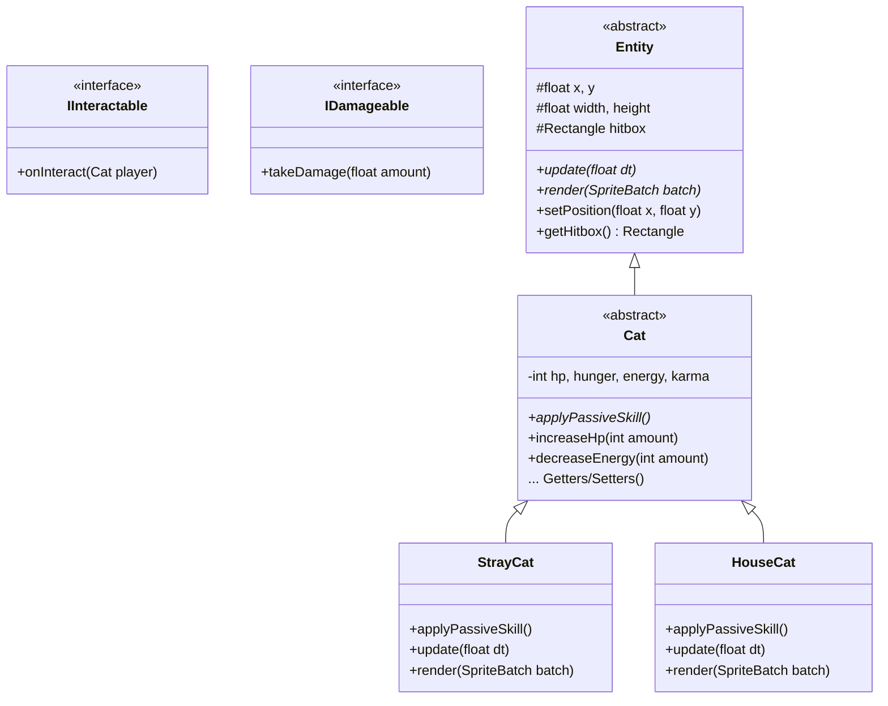

# Kiến Trúc Hệ Thống Thực Thể (Entity Hierarchy)

Tài liệu này giải thích cấu trúc mã nguồn của gói `hust.hedspi.oop.game.entities` và cách các nguyên lý Lập trình hướng đối tượng (OOP) được áp dụng.

## 1. Sơ đồ Lớp (Class Diagram)

## 2. Giải thích áp dụng Nguyên lý OOP

### A. Tính Kế thừa (Inheritance)
- **`Entity`** là lớp cha gốc. Tất cả vật thể trên màn hình (Người chơi, NPC, Thùng rác, Quái vật) đều sẽ kế thừa từ `Entity`. Nó chứa sẵn các trường logic vật lý cốt lõi như `x`, `y`, `width`, `height`, và `hitbox` (dùng để check va chạm).
- **`Cat`** mở rộng từ `Entity`, bổ sung các chỉ số sinh tồn dành riêng cho nhân vật Mèo.

### B. Tính Trừu tượng (Abstraction)
- `Entity` và `Cat` là các **Lớp trừu tượng (Abstract Class)**. Chúng ta không bao giờ tạo trực tiếp `new Entity()` hay `new Cat()`. Chúng chỉ đóng vai trò làm khung xương (blueprint).
- Các hàm `update()`, `render()` và `applyPassiveSkill()` được đánh dấu là `abstract`. Điều này ép buộc các lập trình viên khi tạo class cụ thể (vd: `StrayCat`) phải tự tay viết code để định nghĩa cách Mèo cập nhật, hiển thị và xài kỹ năng.

### C. Tính Đóng gói (Encapsulation)
- Trong lớp `Cat`, các biến `hp`, `hunger`, `energy`, `karma` đều là `private`.
- Các class khác (kể cả class con hay GameManager) không thể sửa trực tiếp máu của mèo (`cat.hp = 999;` -> Báo lỗi ngay). Thay vào đó, phải gọi qua các hàm Setters an toàn đã được kiểm soát giới hạn: `increaseHp()`, `decreaseEnergy()`. Tránh việc máu bị tính toán sai lọt xuống số âm.

### D. Tính Đa hình (Polymorphism)
- Thể hiện rõ nhất ở hàm `applyPassiveSkill()`. 
- Khi `GameManager` giữ biến `Cat player`, nó không cần biết chính xác đó là Mèo Hoang hay Mèo Nhà. Ở mỗi khung hình, nó chỉ cần gọi `player.applyPassiveSkill()`.
- **Mèo Hoang (`StrayCat`)** ghi đè hàm này để tự động tăng sức tấn công nếu máu (HP) < 30.
- **Mèo Nhà (`HouseCat`)** ghi đè hàm này để tự động hồi phục thể lực (Energy) nếu đang đứng trong nhà.
- Cùng một lệnh gọi nhưng kết quả thực thi lại khác nhau tùy thuộc vào Object thực sự là gì.

### E. Giao diện (Interfaces)
- Nhằm mục đích nới lỏng sự phụ thuộc, hệ thống sử dụng Interfaces:
  - **`IInteractable`**: Bất kỳ NPC hay vật thể nào (vd: Cửa ra vào) implement interface này đều bắt buộc phải có hàm `onInteract()`. Mèo khi nhấn nút tương tác chỉ việc check xem Hitbox phía trước có thuộc `IInteractable` không và gọi hàm.
  - **`IDamageable`**: Bất kỳ Object nào (Mèo, Quái vật, Thùng gỗ) muốn có thể bị trừ máu đều implement cái này.

## Tổng Kết
Với kiến trúc này, việc thêm một giống mèo thứ 3 (Ví dụ: `AlienCat`) là cực kỳ dễ dàng. Chỉ việc tạo class `AlienCat extends Cat`, Override lại kỹ năng nội tại mà không cần phải chạm vào hay sửa đổi bất kỳ file quản lý lõi nào. Kiến trúc này triệt để triệt tiêu các câu lệnh `if-else` lồng nhau.
