# Tổng hợp Sơ đồ UML Dự án CatLife

Dưới đây là mã PlantUML tổng hợp toàn bộ các package, class, interface và enum mà chúng ta đã thiết kế và lập trình tính đến hiện tại. Bạn có thể copy đoạn code bên dưới và dán vào [PlantUML Web Server](https://www.plantuml.com/plantuml/uml/) để xem sơ đồ trực quan.

```plantuml
@startuml
skinparam classAttributeIconSize 0
skinparam monochrome false
skinparam packageStyle rectangle

package "hust.hedspi.oop.game" {
    
    class GameCore {
        + create(): void
        + dispose(): void
    }

    package "utils" {
        class Constants {
            + {static} VIETNAMESE_CHARACTERS: String
            + {static} REAL_SECONDS_PER_IN_GAME_MINUTE: float
            + {static} START_HOUR: int
            + {static} START_MINUTE: int
            + {static} HUD_FONT_SIZE: float
            + {static} VIRTUAL_WIDTH: int
            + {static} VIRTUAL_HEIGHT: int
        }

        enum DayOfWeek {
            MONDAY
            TUESDAY
            WEDNESDAY
            THURSDAY
            FRIDAY
            SATURDAY
            SUNDAY
            + next(): DayOfWeek
        }

        enum EventFlag {
            HAS_WIFE
            IS_CASTRATED
            MET_BOSS_CAT
            FOUND_SECRET_TRASH
        }

        enum GameState {
            MENU
            PLAYING
            PAUSED
            MINIGAME
            GAME_OVER
        }

        enum Phase {
            CHILDHOOD
            ADULT
            SENIOR
        }

        enum MinigameID {
            LOVE_HIPHOP
            LOVE_MASSAGE
            LOVE_DETECTIVE
            DAILY_SCRATCH
            DAILY_ESCAPE_SEWER
            DAILY_FIGHT_STRAY
            THIEF_HIDE
            THIEF_ESCAPE_CAGE
            GANG_FIGHT_1VN
            GANG_MASSAGE_BOSS
            GANG_FIGHT_BOSS
            PET_BEG
            PET_BATH
            PET_ESCAPE_VET
        }

        enum GameResult {
            WIN
            LOSE
            UNPLAYED
        }

        class TimeCondition {
            - startHour: int
            - endHour: int
            - validDays: List
            + TimeCondition(startHour: int, endHour: int, validDays: DayOfWeek...)
            + isCurrentlyValid(): boolean
        }

        class EndingCondition {
            - endingName: String
            - priority: int
            - requiredResults: Map
            - EndingCondition(name: String, priority: int)
            + getEndingName(): String
            + getPriority(): int
            + isSatisfied(playerHistory: Map): boolean
        }

        interface IObserver {
            + onNotify(args: Object...): void
        }

        interface ISubject {
            + addObserver(observer: IObserver): void
            + removeObserver(observer: IObserver): void
            + notifyObservers(args: Object...): void
        }
    }

    package "managers" {
        class GameManager <<Singleton>> {
            - static instance: GameManager
            - currentState: GameState
            - player: Cat
            - GameManager()
            + static getInstance(): GameManager
            + startNewGame(isStrayCat: boolean): void
            + update(dt: float): void
            + pauseGame(): void
            + resumeGame(): void
            + getCurrentState(): GameState
            + getPlayer(): Cat
        }

        class TimeManager <<Singleton>> {
            - static instance: TimeManager
            - timer: float
            - inGameHour: int
            - inGameMinute: int
            - currentDayOfWeek: DayOfWeek
            - currentPhase: Phase
            - observers: List
            - TimeManager()
            + static getInstance(): TimeManager
            + resetTime(): void
            + skipToNextMorning(): void
            + update(deltaTime: float): void
            - incrementTime(): void
            + getInGameHour(): int
            + getInGameMinute(): int
            + getCurrentDayOfWeek(): DayOfWeek
            + getCurrentPhase(): Phase
        }

        class StoryManager <<Singleton>> {
            - static instance: StoryManager
            - playerHistory: Map
            - endingsDatabase: List
            - StoryManager()
            + static getInstance(): StoryManager
            + initHistory(): void
            + resetStoryFlags(): void
            - buildEndingsConfig(): void
            + recordResult(id: MinigameID, isWin: boolean): void
            - triggerInstantGameOver(reason: String): void
            + isMinigameUnlocked(requestedGame: MinigameID): boolean
            + evaluateFinalEnding(player: Cat): EndingCondition
        }

        class ScreenManager <<Singleton>> {
            - static instance: ScreenManager
            - game: Game
            - screenStack: Stack
            - ScreenManager()
            + static getInstance(): ScreenManager
            + initialize(game: Game): void
            + pushScreen(screen: Screen): void
            + popScreen(): void
            + clearAndSetScreen(screen: Screen): void
            + getCurrentScreen(): Screen
        }

        class ResourceManager <<Singleton>> {
            - static instance: ResourceManager
            + dialogFont: BitmapFont
            + nameFont: BitmapFont
            + hudFont: BitmapFont
            - bundle: I18NBundle
            - ResourceManager()
            + static getInstance(): ResourceManager
            + initialize(): void
            + getBundle(): I18NBundle
            - generateFonts(): void
            + dispose(): void
        }

        class SoundManager <<Singleton>> {
            - static instance: SoundManager
            - assetManager: AssetManager
            - currentBGM: Music
            - bgmVolume: float
            - sfxVolume: float
            - SoundManager()
            + static getInstance(): SoundManager
            + playBGM(filePath: String): void
            + stopBGM(): void
            + playSFX(filePath: String): void
            + setBGMVolume(volume: float): void
            + setSFXVolume(volume: float): void
        }

        class MapManager <<Singleton>> {
            - static instance: MapManager
            - currentMap: TiledMap
            - mapRenderer: OrthogonalTiledMapRenderer
            - collisionRectangles: List<Rectangle>
            - triggerZones: List<TriggerZone>
            - npcs: List<NPC>
            - MapManager()
            + static getInstance(): MapManager
            + loadMap(filePath: String): void
            - loadCollisions(): void
            - loadTriggers(): void
            + render(camera: OrthographicCamera): void
            + getCollisionRectangles(): List<Rectangle>
            + getTriggerZones(): List<TriggerZone>
            + getNpcs(): List<NPC>
            + dispose(): void
        }
    }

    package "entities" {
        interface IInteractable {
            + onInteract(player: Cat): void
        }

        interface IDamageable {
            + takeDamage(amount: float): void
        }

        abstract class Entity {
            # x: float
            # y: float
            # width: float
            # height: float
            # hitbox: Rectangle
            + Entity(x: float, y: float, width: float, height: float)
            + {abstract} update(dt: float): void
            + {abstract} render(batch: SpriteBatch): void
            + getX(): float
            + getY(): float
            + setPosition(x: float, y: float): void
            + getHitbox(): Rectangle
        }

        abstract class Cat {
            - hp: int
            - hunger: int
            - energy: int
            - speed: float
            - attackPower: int
            # texture: Texture
            - currentState: ICatState
            + Cat(x: float, y: float, width: float, height: float)
            # createPlaceholderTexture(color: Color): void
            + changeState(newState: ICatState): void
            + getCurrentState(): ICatState
            + {abstract} applyPassiveSkill(dt: float): void
            + update(dt: float): void
            + render(batch: SpriteBatch): void
            + dispose(): void
        }

        class StrayCat {
            - BASE_ATTACK_POWER: int
            + StrayCat(x: float, y: float, width: float, height: float)
            + applyPassiveSkill(dt: float): void
        }

        class HouseCat {
            + HouseCat(x: float, y: float, width: float, height: float)
            + applyPassiveSkill(dt: float): void
        }

        class NPC {
            - npcName: String
            + NPC(x: float, y: float, w: float, h: float, color: CatColor, name: String)
            + applyPassiveSkill(dt: float): void
            + update(dt: float): void
            + render(batch: SpriteBatch): void
            + getNpcName(): String
        }

        class TriggerZone {
            - timeCondition: TimeCondition
            - linkedMinigame: IMinigameStrategy
            - zoneName: String
            + TriggerZone(x: float, y: float, w: float, h: float, name: String)
            + setTimeCondition(condition: TimeCondition): void
            + setLinkedMinigame(minigame: IMinigameStrategy): void
            + onInteract(player: Cat): void
            + update(dt: float): void
            + render(batch: SpriteBatch): void
        }
    }

    package "components" {
        interface ICatState {
            + enter(cat: Cat): void
            + update(cat: Cat, dt: float): void
            + render(cat: Cat, batch: SpriteBatch): void
            + exit(cat: Cat): void
        }

        class IdleState {
            + enter(cat: Cat): void
            + update(cat: Cat, dt: float): void
            + render(cat: Cat, batch: SpriteBatch): void
            + exit(cat: Cat): void
        }

        class RunState {
            - {static} SPEED: float
            + enter(cat: Cat): void
            + update(cat: Cat, dt: float): void
            + render(cat: Cat, batch: SpriteBatch): void
            + exit(cat: Cat): void
        }

        class SleepState {
            - sleepTimer: float
            + enter(cat: Cat): void
            + update(cat: Cat, dt: float): void
            + render(cat: Cat, batch: SpriteBatch): void
            + exit(cat: Cat): void
        }
    }

    package "skills" {
        interface Skill {
            + getName(): String
            + getCooldown(): float
            + canUse(cat: Cat): boolean
            + use(cat: Cat): void
            + update(delta: float): void
        }

        abstract class BaseSkill {
            # name: String
            # cooldown: float
            # currentCooldown: float
            # staminaCost: int
            + BaseSkill(name: String, cooldown: float)
            + canUse(cat: Cat): boolean
            + use(cat: Cat): void
            # {abstract} performAction(cat: Cat): void
        }

        class DashSkill {
            + DashSkill()
            # performAction(cat: Cat): void
        }
        
        class HissSkill {
            + HissSkill()
            # performAction(cat: Cat): void
        }

        class ScratchSkill {
            + ScratchSkill()
            # performAction(cat: Cat): void
        }
    }

    package "minigames" {
        interface IMinigameStrategy {
            + start(): void
            + update(dt: float): void
            + render(batch: SpriteBatch): void
            + isFinished(): boolean
            + isWon(): boolean
            + dispose(): void
        }

        class RhythmMinigame {
            - finished: boolean
            - won: boolean
            - timer: float
            + start(): void
            + update(dt: float): void
            + render(batch: SpriteBatch): void
        }

        package "cao_mong" {
            class CaoMongMinigame {
                - timer: float
                - score: int
                - gameOver: boolean
                - exitRequested: boolean
                - won: boolean
                - activeArrow: int
                - handActive: boolean[2]
                - handAnimTime: float[2]
                - handTarget: int[2]
                + start(): void
                + update(dt: float): void
                + render(batch: SpriteBatch): void
                + isFinished(): boolean
                + isWon(): boolean
                + dispose(): void
                - handOf(dir: int): int
                - getLerpFactor(t: float): float
                - zoneCenter(dir: int): float[]
                - renderHand(batch, h, region): void
                - renderGameOver(batch: SpriteBatch): void
            }
        }
    }

    package "screens" {
        interface Screen {
            + render(delta: float): void
            + dispose(): void
        }

        class TestScreen {
            - batch: SpriteBatch
            - timeString: String
            - dayString: String
            - uiNeedsUpdate: boolean
            + TestScreen()
            - updateUIData(): void
            + render(delta: float): void
            + dispose(): void
            + onNotify(args: Object...): void
        }

        class MinigameScreen {
            - strategy: IMinigameStrategy
            - batch: SpriteBatch
            - shouldExit: boolean
            + MinigameScreen(strategy: IMinigameStrategy)
            + render(delta: float): void
        }

        class PlayScreen {
            - gameCamera: OrthographicCamera
            - gamePort: Viewport
            - batch: SpriteBatch
            - interactionUI: InteractionUI
            + PlayScreen()
            + render(delta: float): void
        }

        package "hud" {
            class InteractionUI {
                - rootTable: Table
                - dialogLabel: Label
                - nameLabel: Label
                - player: Cat
                + InteractionUI(player: Cat)
                + show(zone: TriggerZone): void
                + hide(): void
                + getTable(): Table
            }
        }
    }
}

' Relationships
GameCore --> ScreenManager : uses
GameCore --> ResourceManager : uses
GameCore --> TestScreen : creates

TimeManager ..|> ISubject
TestScreen ..|> IObserver
TestScreen ..|> Screen : implements
MinigameScreen ..|> Screen : implements

TimeManager "1" o--> "many" IObserver : observers
StoryManager "1" o--> "many" EndingCondition : endingsDatabase
GameManager --> GameState : currentState
GameManager --> Cat : player
TimeManager --> DayOfWeek : currentDayOfWeek
TimeManager --> Phase : currentPhase

Entity <|-- Cat
Cat <|-- StrayCat
Cat <|-- HouseCat
Cat <|-- NPC
Entity <|-- TriggerZone

TriggerZone ..|> IInteractable

InteractionUI --> Cat : observes
PlayScreen --> InteractionUI : uses
MapManager "1" o--> "many" NPC : npcs
MapManager "1" o--> "many" TriggerZone : triggerZones

ICatState <|.. IdleState
ICatState <|.. RunState
ICatState <|.. SleepState

Cat "1" *--> "1" ICatState : currentState

Skill <|.. BaseSkill
BaseSkill <|-- DashSkill
BaseSkill <|-- HissSkill
BaseSkill <|-- ScratchSkill

IMinigameStrategy <|.. RhythmMinigame
IMinigameStrategy <|.. CaoMongMinigame
MinigameScreen *--> IMinigameStrategy : strategy

@enduml
```

