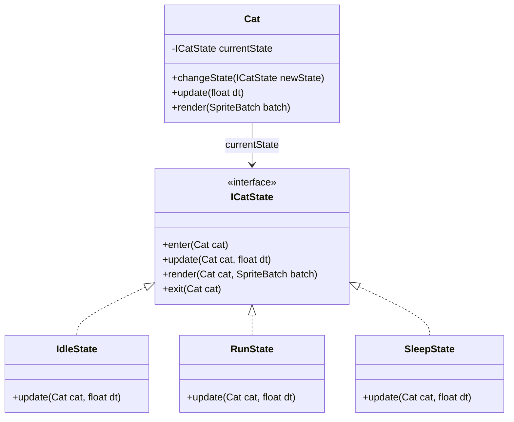

# Kiến Trúc Máy Trạng Thái (State Pattern)

Tài liệu này giải thích cách áp dụng Design Pattern **State Pattern** vào hệ thống quản lý hành vi và di chuyển của nhân vật Mèo trong dự án `CatLife`.

## 1. Vấn Đề Gặp Phải (The Problem)
Trong lập trình game thông thường, nếu quản lý hành vi nhân vật trong một hàm `update()` duy nhất, chúng ta rất dễ tạo ra một đống code `if-else` hoặc `switch-case` khổng lồ (hay còn gọi là Spaghetti Code):

```java
// VÍ DỤ VỀ CODE XẤU (KHÔNG DÙNG STATE PATTERN):
public void update(float dt) {
    if (isSleeping) {
        // Hồi máu...
        if (Gdx.input.isKeyJustPressed(Input.Keys.SPACE)) {
            isSleeping = false; // Thức dậy
        }
    } else if (isRunning) {
        // Tính toán tọa độ x, y...
        if (!Gdx.input.isKeyPressed(Input.Keys.W)) {
            isRunning = false; // Dừng lại
        }
    } else {
        // Đứng yên...
        if (Gdx.input.isKeyPressed(Input.Keys.W)) {
            isRunning = true;
        }
    }
}
```
Nhược điểm của cách làm trên:
- Hàm update sẽ phình to ra hàng nghìn dòng nếu mèo có thêm các hành vi: Trèo cây, Cào xước, Ăn uống, Bị choáng...
- Rất dễ sinh ra lỗi (bug) logic khi các biến boolean (isSleeping, isRunning) xung đột lẫn nhau (vd: Mèo vừa ngủ vừa chạy).

## 2. Giải Pháp: State Pattern
Chúng ta tách mỗi trạng thái thành một Class độc lập. Class `Cat` (Context) sẽ không tự mình xử lý logic di chuyển nữa, mà "ủy quyền" (Delegate) cho Class State hiện tại xử lý.

### Sơ Đồ Lớp (Class Diagram)



## 3. Cách Hoạt Động (How it works)
1. **Interface `ICatState`**: Định nghĩa 4 hàm bắt buộc cho vòng đời của một trạng thái:
   - `enter()`: Gọi 1 lần duy nhất khi vừa chuyển sang trạng thái này (Vd: Phát âm thanh "Zzz" khi bắt đầu ngủ).
   - `update()`: Chạy liên tục mỗi frame. Xử lý logic và kiểm tra điều kiện chuyển trạng thái.
   - `render()`: Chạy liên tục mỗi frame. Xử lý việc vẽ Animation tương ứng (Chạy, Ngủ).
   - `exit()`: Gọi 1 lần duy nhất trước khi rời khỏi trạng thái (Vd: Phát âm thanh "Meow" khi thức giấc).
2. **Lớp `Cat`**:
   - Chỉ giữ duy nhất 1 biến `currentState`.
   - Hàm `update()` của Cat cực kỳ ngắn gọn: `currentState.update(this, dt)`.
   - Khi muốn đổi trạng thái: Gọi `cat.changeState(new SleepState())`. Hàm này sẽ tự động gọi `exit()` của trạng thái cũ và `enter()` của trạng thái mới.

## 4. Lợi ích đạt được
- **Dễ dàng mở rộng (Open/Closed Principle)**: Nếu sau này cần thêm trạng thái "Ăn" (EatState), chúng ta chỉ cần tạo một file `EatState.java` implements `ICatState` và chuyển `cat.changeState(new EatState())`. Không cần sửa lại file `Cat.java` hay bất kỳ trạng thái nào khác.
- **Code sạch sẽ (Clean Code)**: Logic di chuyển bằng phím WASD chỉ nằm gọn trong `RunState.java`. Logic hồi năng lượng khi ngủ chỉ nằm gọn trong `SleepState.java`. Rất dễ tìm lỗi (debug).
