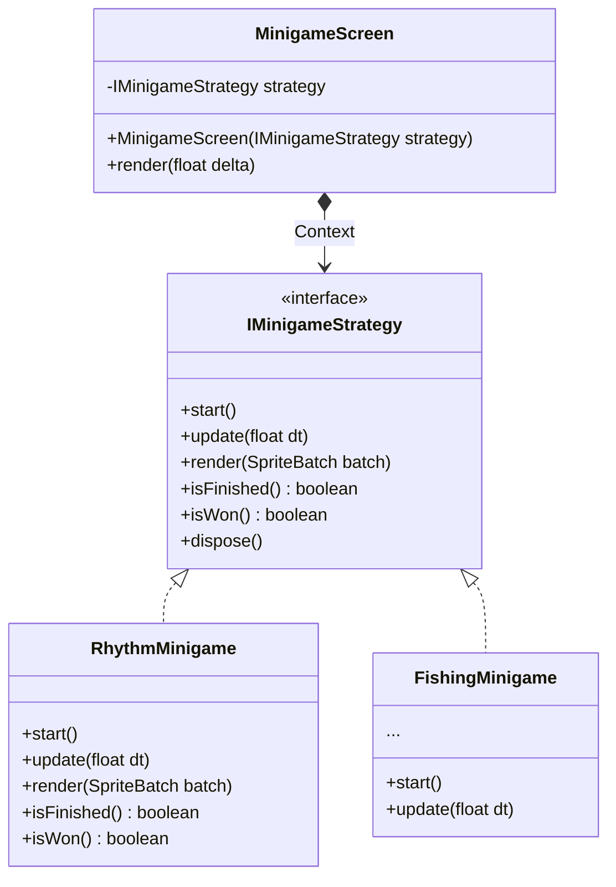

# Kiến Trúc Minigame (Strategy Pattern)

Tài liệu này giải thích cách áp dụng Design Pattern **Strategy Pattern** vào hệ thống quản lý các Minigame trong dự án `CatLife`.

## 1. Vấn Đề Gặp Phải (The Problem)
Game CatLife dự kiến có nhiều minigame khác nhau (Câu cá, Bắt chuột, Nhảy theo nhịp...). 
Nếu chúng ta tạo các Class Screen riêng biệt (như `FishingScreen`, `RhythmScreen`, `CatchMouseScreen`...) cho mỗi trò chơi, thư mục `screens/` sẽ trở nên cực kỳ rườm rà. Mã nguồn xử lý việc chuyển cảnh (push/pop screen), tạm dừng game, hay vẽ nút ESC cũng sẽ bị lặp lại nhiều lần.

## 2. Giải Pháp: Strategy Pattern
Thay vì tạo nhiều Screen, chúng ta chỉ tạo **MỘT** Screen duy nhất dùng chung: `MinigameScreen`. 
Screen này sẽ nhận vào một "Thuật toán/Chiến lược" (Strategy) - chính là logic của minigame cụ thể - và chạy nó.

### Sơ Đồ Lớp (Class Diagram)



## 3. Cách Hoạt Động (How it works)
1. **Interface `IMinigameStrategy`**: Chuẩn hóa cách giao tiếp với mọi minigame. Bất kỳ minigame nào cũng phải có các hàm `start()`, `update()`, `render()` và trả về kết quả qua `isFinished()`, `isWon()`.
2. **Context `MinigameScreen`**: Giữ một tham chiếu đến interface `IMinigameStrategy`. Trong hàm `render()` của Screen, nó chỉ việc gọi `strategy.update(delta)` và `strategy.render(batch)`. Mọi thao tác kết thúc game và quay lại Map chính được gom chung ở đây.
3. **Thực thi**: Khi người chơi chạm vào một TriggerZone kích hoạt minigame Nhảy múa, chúng ta chỉ cần chạy dòng lệnh:
   ```java
   ScreenManager.getInstance().pushScreen(new MinigameScreen(new RhythmMinigame()));
   ```

## 4. Lợi ích đạt được
- **Dễ dàng mở rộng (Open/Closed Principle)**: Khi Team Design yêu cầu thêm một Minigame mới (VD: Leo Cây), bạn chỉ việc tạo class `ClimbTreeMinigame implements IMinigameStrategy` và truyền vào `MinigameScreen`. Không cần tạo thêm Screen mới, không cần sửa đổi logic chuyển cảnh.
- **Tái sử dụng code**: Logic vẽ thông báo thắng thua, nút bấm Thoát (ESC), hay tạm dừng game chính được viết một lần duy nhất trong `MinigameScreen`.
