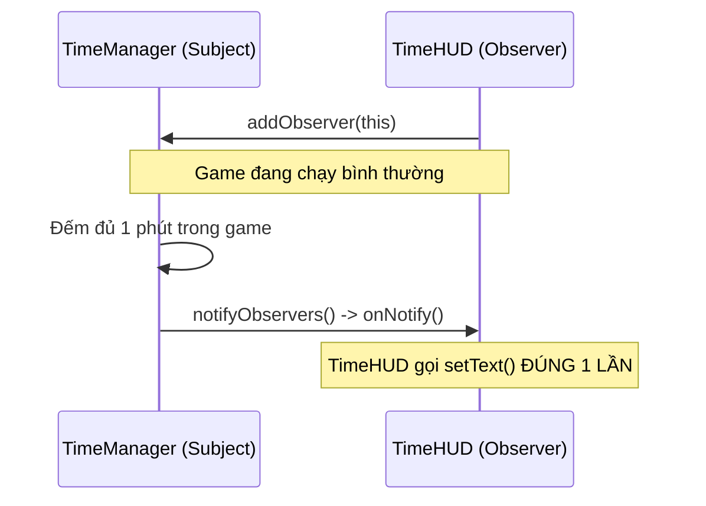

# Kiến Trúc Giao Diện Người Dùng (UI Architecture)

Tài liệu này mô tả định hướng và tiêu chuẩn để phát triển Giao diện Người dùng (UI) và Màn hình HUD (Heads-Up Display) cho dự án CatLife.

## 1. Công nghệ Sử dụng
Dự án **KHÔNG** sử dụng `SpriteBatch` để vẽ các nút bấm hay văn bản một cách thủ công (tính toán x, y cứng). Thay vào đó, chúng ta bắt buộc sử dụng **Scene2D** và hệ thống UI tích hợp sẵn của libGDX (`com.badlogic.gdx.scenes.scene2d.ui.*`).

- **Stage**: Đóng vai trò là "Sân khấu" chứa mọi phần tử UI.
- **Table**: Layout manager chính. Giúp các thành phần UI tự động co giãn và căn lề (responsive) mà không cần hardcode tọa độ.
- **Widgets**: `TextButton`, `Label`, `ProgressBar`, `Image`...

## 2. Cấu trúc Thư mục

Mã nguồn UI sẽ được đặt tại `core/src/main/java/hust/hedspi/oop/game/`:

```text
├── screens/
│   ├── MainMenuScreen.java    # Màn hình bắt đầu game
│   ├── PlayScreen.java        # Màn hình đi dạo trên Map (Chứa Stage cho Game + Stage cho HUD)
│   ├── MinigameScreen.java    # Màn hình dùng chung để chạy các Strategy Minigame
│   ├── EndingScreen.java      # Màn hình hiển thị kết cục
│   └── hud/
│       ├── TimeHUD.java       # Hiển thị đồng hồ, ngày tháng
│       ├── PlayerHUD.java     # Hiển thị thanh máu (HP), Energy, Hunger
│       └── InteractionUI.java # Hiện nút [E] khi tới gần khu vực/NPC
├── debug/
│   └── DebugMenu.java         # Cửa sổ F12 dành cho Developer (Sử dụng VisUI/Scene2D)
```

## 3. Tối ưu Hiệu năng bằng Observer Pattern

### A. Vấn Đề (The Problem)
Cách tệ nhất để làm HUD (Thanh Máu, Thời Gian) là liên tục hỏi data ở mỗi khung hình:

```java
// CODE TỆ (Gây lag và lãng phí CPU):
public void render(float dt) {
    int currentHp = GameManager.getInstance().getPlayer().getHp(); // Gọi mỗi frame!
    hpLabel.setText("HP: " + currentHp);
}
```

### B. Giải Pháp: Observer Pattern
HUD chỉ được vẽ lại (cập nhật nội dung) **khi và chỉ khi** dữ liệu thực sự thay đổi.

1. **`ISubject` (Kẻ gửi tin)**: `TimeManager`, `Cat` (hoặc `GameManager`).
2. **`IObserver` (Kẻ nhận tin)**: `TimeHUD`, `PlayerHUD`.



### C. Ví dụ Triển khai

```java
// Mẫu tham khảo cho TimeHUD
public class TimeHUD implements IObserver {
    private Label timeLabel;
    
    public TimeHUD() {
        // ... Khởi tạo Label
        TimeManager.getInstance().addObserver(this); // Đăng ký nhận tin
    }
    
    @Override
    public void onNotify(Object... args) {
        // Chỉ chạy khi TimeManager bảo "Thời gian đã đổi rồi đó!"
        TimeManager tm = TimeManager.getInstance();
        timeLabel.setText(String.format("%02d:%02d", tm.getHour(), tm.getMinute()));
    }
}
```

## 4. Tổng Kết Luật Code UI
1. **Không Hardcode tọa độ**: Sử dụng `Table` để căn chỉnh (VD: `table.add(button).pad(10).expand().bottom().right();`).
2. **Data-Driven UI**: UI không được chứa logic game (VD: Không viết code trừ máu trong file UI). UI chỉ hiển thị những gì Manager bảo nó hiển thị.
3. **Cập nhật Lười biếng (Lazy Update)**: Bắt buộc dùng `Observer Pattern` để báo cho UI biết khi nào cần cập nhật chữ/hình ảnh.
